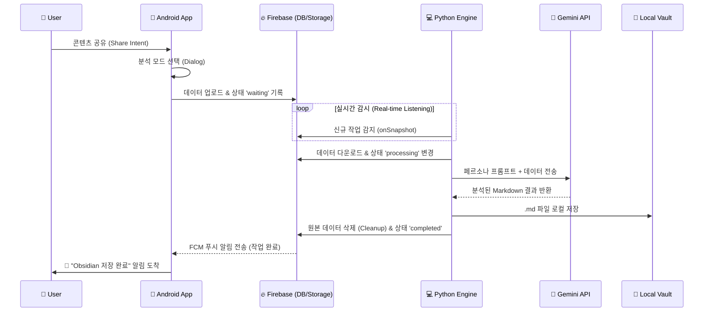

# Automatic-Knowledge-Acquisition (Project: ToSecondBrain)

> **"스마트폰의 정보를 터치 한 번으로 제2의 뇌(Obsidian)에 이식하다."**

이 프로젝트는 **Android 앱**을 통해 수집한 데이터(텍스트, 이미지)를 **Python 엔진**이 AI로 분석하여, 로컬 **Obsidian Vault**에 자동으로 정리해 주는 개인화된 지식 관리 파이프라인 시스템입니다.

---

## 🌟 프로젝트 개요 (Overview)

일상에서 마주치는 유용한 정보를 스마트폰으로 수집하고, 이를 PC의 로컬 지식 저장소로 옮기는 과정은 번거롭습니다. 이 시스템은 **Android의 공유(Share) 기능**과 **Google Gemini AI**를 활용하여 이 과정을 완전히 자동화합니다.

### 🔄 전체 워크플로우

1. **수집 (Client):** 안드로이드 앱에서 '공유하기'를 통해 링크, 텍스트, 이미지를 전송합니다.
2. **전송 (Middleware):** 데이터는 Firebase(Firestore/Storage)를 통해 실시간으로 중계됩니다.
3. **분석 (Engine):** PC에서 대기 중인 Python 스크립트가 데이터를 감지하고 Gemini Pro에게 분석을 요청합니다.
4. **저장 (Storage):** 분석된 내용은 태그가 포함된 깔끔한 Markdown 문서로 변환되어 내 Obsidian 폴더에 저장됩니다.
5. **알림 (Feedback):** 작업이 완료되면 스마트폰으로 푸시 알림(FCM)이 도착합니다.

---

## 🚀 주요 기능 (Key Features)

### 📱 Android Client (App)

* **시스템 공유 메뉴 통합:** 브라우저, 갤러리 등 어떤 앱에서든 '공유하기' 버튼(Intent)을 통해 데이터를 보낼 수 있습니다.
* **5가지 AI 페르소나 모드:** 데이터 전송 시 원하는 분석 관점을 선택할 수 있는 다이얼로그를 제공합니다.
  * 📝 **학습 노트:** 개념 정의 및 암기 포인트 위주의 정리
  * 💻 **기술 뉴스:** 개발자 관점의 트렌드 및 기술 분석
  * 🎨 **아이디어:** 기획자 관점의 브레인스토밍 및 활용 방안
  * 📈 **경제 공부:** 시장 원리 및 투자 인사이트 도출
  * 📂 **일반/기타:** 요약 및 아카이빙
* **멀티미디어 지원:** 단순 텍스트(`text/plain`)뿐만 아니라 단일 이미지, 다중 이미지(`image/*`) 업로드를 지원합니다.
* **실시간 피드백:** 데이터 업로드 진행 상황을 프로그레스 바와 텍스트로 실시간으로 보여주며, 처리가 완료되면 푸시 알림을 받습니다.

### 🧠 Python Engine (PC)

* **Gemini Pro 기반 분석:** 이미지와 텍스트의 맥락을 이해하고 사용자가 선택한 페르소나에 맞춰 고품질의 노트를 생성합니다.
* **자동 파일 관리:** 생성된 마크다운 파일을 지정된 로컬 경로(Obsidian Inbox)에 저장하며, 파일명 충돌을 방지합니다.
* **Zero-Maintenance:** 처리가 끝난 데이터(Firestore 문서 및 Storage 이미지)는 자동으로 삭제되어 보안을 유지하고 비용을 절약합니다.
* **윈도우 자동화:** 배치 파일(`run_brain.bat`)을 통해 PC 부팅 시 백그라운드에서 실행되도록 설정할 수 있습니다.

---

## 🛠️ 시스템 아키텍처 (Architecture)



---


## 🏗️ 기술 스택 (Tech Stack)

| **구분**             | **기술**       | **상세 내용**                                     |
| -------------------------- | -------------------- | ------------------------------------------------------- |
| **Android Client**   | **Java**       | Native App Development                                  |
|                            | Android SDK          | Min SDK 24, Target SDK 36                               |
|                            | UI/UX                | XML Layout, Material Design 3                           |
|                            | Integration          | Firebase SDK (Firestore, Storage, Messaging)            |
| **Backend / Engine** | **Python 3.x** | Core Logic Script                                       |
|                            | Libraries            | `firebase-admin`,`google-generativeai`,`requests` |
| **Infrastructure**   | **Firebase**   | Firestore (DB), Storage (File), FCM (Push)              |
| **AI Model**         | **Gemini**     | Gemini-2.5-Pro (Multimodal)                             |

---

## 📂 프로젝트 구조 (Directory Structure)

```
Automatic-Knowledge-Acquisition/
├── 📱 android-client/           # 안드로이드 앱 프로젝트
│   ├── app/
│   │   ├── src/main/java/     # Java 소스 (MainActivity, FCMService)
│   │   ├── src/main/res/      # 리소스 (Layout, Strings, Icons)
│   │   └── google-services.json # [중요] Firebase 설정 파일 (직접 추가 필요)
│   └── build.gradle           # 앱 빌드 설정
│
├── 🧠 python-engine/            # PC 구동용 파이썬 스크립트
│   ├── brain.py               # 메인 로직 파일
│   ├── run_brain.bat          # 윈도우 실행 배치 파일
│   └── serviceAccountKey.json # [중요] Firebase 관리자 키 (직접 추가 필요)
│
└── README.md                  # 프로젝트 문서
```

---

## ⚙️ 설치 및 시작하기 (Getting Started)

이 시스템을 구축하려면  **Firebase 프로젝트** ,  **PC 환경** , **안드로이드 폰** 세 가지 설정이 필요합니다.

### 1. Firebase 프로젝트 설정 (공통)

1. [Firebase Console](https://console.firebase.google.com/)에서 새 프로젝트를 생성합니다.
2. **Firestore Database**와 **Storage**를 생성하고 규칙(Rules)을 테스트 모드 등으로 설정합니다.
3. **프로젝트 설정**에서 Android 앱을 추가하고 패키지명(`com.hyunji.automaticknowledgeacquisition`)을 입력합니다.
4. `google-services.json`을 다운로드합니다.
5. **서비스 계정** 탭에서 새 비공개 키를 생성하여 `serviceAccountKey.json`을 다운로드합니다.

### 2. Python Engine 설정 (PC)

1. `python-engine` 폴더로 이동합니다.
2. 필수 라이브러리를 설치합니다.
   **Bash**

   ```
   pip install firebase-admin google-generativeai requests
   ```
3. 다운로드한 `serviceAccountKey.json` 파일을 폴더 안에 넣습니다.
4. `brain.py` 파일을 열어 다음 내용을 수정합니다.

   * `OBSIDIAN_PATH`: 본인의 Obsidian Inbox 절대 경로 (예: `C:/Users/HoKyoung/Obsidian/Inbox`)
   * `GEMINI_API_KEY`: Google AI Studio에서 발급받은 API Key (또는 환경변수 설정)
5. `run_brain.bat` 파일을 실행하여 "Brain is Active!" 메시지가 나오는지 확인합니다.

### 3. Android Client 설정 (Mobile)

1. Android Studio를 실행하고 `android-client` 폴더를 엽니다 ("Open Project").
2. 다운로드한 `google-services.json` 파일을 `app/` 폴더 안에 복사해 넣습니다.
3. 스마트폰을 연결하고 앱을 빌드 및 설치(Run)합니다.
   * *Note: Android 13 이상에서는 최초 실행 시 알림 권한 허용이 필요합니다.*

---

## 📝 사용 가이드 (How to Use)

1. **준비:** PC에서 `brain.py`가 실행 중인지 확인합니다. (보통 시작 프로그램으로 등록해 둡니다.)
2. **실행:** 스마트폰에서 저장하고 싶은 뉴스 기사나 사진을 봅니다.
3. **공유:** `공유하기(Share)` 버튼을 누르고 앱 목록에서 **ToSecondBrain**을 선택합니다.
4. **선택:** 팝업창에서 해당 정보에 적합한  **분석 모드** (예: 학습 노트, 기술 뉴스 등)를 선택합니다.
5. **완료:** 잠시 후 PC 처리가 완료되면 핸드폰으로 **"✅ Obsidian 저장 완료"** 알림이 오고, PC의 Obsidian 폴더에 파일이 생성됩니다.

---

<div align="center">

Created by `<b>`Ho-gyeong Cha `</b>` based on Gemini & Obsidian Workflow.

</div>
